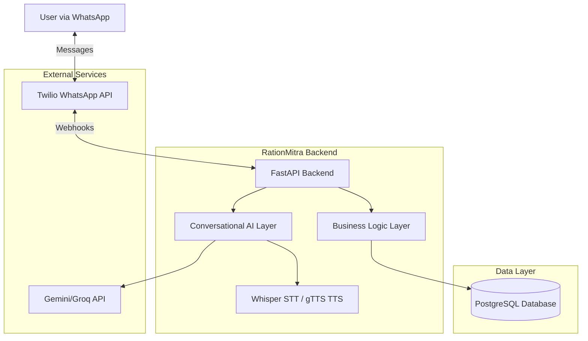

# Design Document: RationMitra

## Overview

RationMitra is a WhatsApp-based AI assistant that helps Indian citizens discover and claim government benefits. The system architecture follows a layered approach with clear separation between the WhatsApp interface, conversational AI layer, business logic, and data persistence.

The system uses a conversational approach to collect user information, applies rule-based and AI-enhanced eligibility matching against a database of government schemes, and provides personalized guidance through the claiming process. The design prioritizes simplicity, accessibility for low-literacy users, and reliability on free-tier infrastructure.

Key design principles:
- **Conversational-first**: All interactions through natural language via WhatsApp
- **Accessibility**: Support for low literacy, multiple languages, voice input
- **Privacy**: Encryption of sensitive data, secure storage
- **Scalability**: Asynchronous processing, efficient database design
- **Reliability**: Graceful error handling, fallback mechanisms
- **Cost-effective**: Free-tier services for MVP deployment

## Architecture

### High-Level Architecture



### Component Architecture

The system is organized into the following major components:

1. **WhatsApp Interface Layer**: Handles Twilio webhook integration, message routing, and response formatting
2. **Conversational AI Layer**: Manages natural language understanding, context, and response generation
3. **Profile Builder**: Conducts structured interviews to collect user information
4. **Eligibility Matcher**: Evaluates user profiles against scheme eligibility rules
5. **Claiming Guide Generator**: Creates personalized step-by-step claiming instructions
6. **Application Tracker**: Manages user-reported application progress
7. **Reminder System**: Schedules and sends time-based follow-up messages
8. **Document Assistant**: Provides document guidance and storage
9. **Scheme Database Manager**: Manages scheme information and eligibility rules
10. **Speech Processor**: Handles voice note transcription and text-to-speech

### Technology Stack

- **Backend Framework**: FastAPI (Python) - async support, automatic API docs, type hints
- **Database**: PostgreSQL on Supabase - free tier, managed service
- **LLM**: Google Gemini API or Groq API - free tier for MVP
- **Speech-to-Text**: OpenAI Whisper - local processing, multilingual
- **Text-to-Speech**: gTTS (Google Text-to-Speech) - free, supports Hindi/English
- **WhatsApp Integration**: Twilio WhatsApp Business API
- **Deployment**: Render or Railway - free tier with auto-deploy
- **Background Jobs**: APScheduler - for reminder scheduling
- **Encryption**: cryptography library (Fernet) - for sensitive data

## Components and Interfaces

### 1. WhatsApp Interface Layer

**Responsibilities**:
- Receive incoming messages from Twilio webhooks
- Route messages to appropriate handlers
- Format and send responses via Twilio API
- Handle media (voice notes, images, documents)
- Manage message queuing and retry logic

**Key Interfaces**:

```python
class WhatsAppInterface:
    def receive_message(webhook_data: dict) -> IncomingMessage
    def send_text_message(phone_number: str, message: str) -> bool
    def send_media_message(phone_number: str, media_url: str, caption: str) -> bool
    def download_media(media_url: str) -> bytes
    def handle_webhook(request: Request) -> Response
```

**Message Flow**:
1. Twilio sends webhook POST request with message data
2. Interface extracts phone number, message content, media URLs
3. Creates IncomingMessage object with normalized data
4. Routes to Conversational AI Layer
5. Receives response from AI Layer
6. Formats and sends via Twilio API

### 2. Conversational AI Layer

**Responsibilities**:
- Understand user intent from natural language input
- Maintain conversation context and state
- Generate appropriate responses
- Adapt language complexity based on user literacy
- Handle code-switching (Hindi/English mixing)
- Route to appropriate business logic components

**Key Interfaces**:

```python
class ConversationalAI:
    def process_message(user_id: str, message: str, context: ConversationContext) -> AIResponse
    def extract_intent(message: str) -> Intent
    def generate_response(intent: Intent, data: dict, context: ConversationContext) -> str
    def adapt_language_level(text: str, literacy_level: LiteracyLevel) -> str
    def maintain_context(user_id: str, turn: ConversationTurn) -> ConversationContext
```

**Context Management**:
- Store conversation state (current flow, collected data, last intent)
- Track user preferences (language, literacy level)
- Maintain short-term memory (last 10 messages)
- Handle conversation interruptions and resumption

**Intent Classification**:
- START_ONBOARDING: New user wants to begin
- ANSWER_PROFILE_QUESTION: Responding to profile building
- VIEW_BENEFITS: Want to see eligible schemes
- GET_CLAIMING_GUIDE: Want instructions for a scheme
- UPDATE_APPLICATION_STATUS: Reporting progress
- ASK_DOCUMENT_HELP: Need document guidance
- CHECK_STATUS: Want to see application status
- GENERAL_QUERY: Other questions about schemes
- HELP: Need assistance using the system

### 3. Profile Builder

**Responsibilities**:
- Conduct 5-7 question interview
- Extract structured data from natural language responses
- Handle incomplete or ambiguous answers
- Validate collected information
- Store complete profiles

**Key Interfaces**:

```python
class ProfileBuilder:
    def start_interview(user_id: str) -> Question
    def process_answer(user_id: str, answer: str, current_question: Question) -> InterviewState
    def extract_profile_data(answer: str, question_type: QuestionType) -> ProfileField
    def validate_profile(profile: UserProfile) -> ValidationResult
    def get_next_question(profile: PartialProfile) -> Question
    def complete_profile(user_id: str, profile: UserProfile) -> bool
```

**Interview Flow**:
1. **Question 1**: Age and gender
2. **Question 2**: Location (state, district, village/city)
3. **Question 3**: Occupation and income level
4. **Question 4**: Family composition (spouse, children, dependents)
5. **Question 5**: Current benefits being received
6. **Question 6**: Land ownership (for farmers)
7. **Question 7**: Special circumstances (disability, widow, BPL card)

**Data Extraction**:
- Use LLM with structured prompts to extract fields
- Validate extracted data against expected formats
- Ask clarifying questions for ambiguous responses
- Handle "don't know" or "not applicable" responses

### 4. Eligibility Matcher

**Responsibilities**:
- Evaluate user profiles against scheme eligibility rules
- Apply rule-based matching with AI-enhanced reasoning
- Categorize schemes (receiving, eligible, future eligible)
- Calculate financial impact
- Rank schemes by priority

**Key Interfaces**:

```python
class EligibilityMatcher:
    def match_all_schemes(profile: UserProfile) -> EligibilityReport
    def check_eligibility(profile: UserProfile, scheme: Scheme) -> EligibilityResult
    def explain_eligibility(profile: UserProfile, scheme: Scheme) -> str
    def calculate_financial_impact(eligible_schemes: List[Scheme]) -> float
    def rank_schemes(eligible_schemes: List[EligibilityResult]) -> List[RankedScheme]
    def categorize_schemes(profile: UserProfile, all_schemes: List[Scheme]) -> CategorizedSchemes
```

**Eligibility Evaluation Logic**:

```python
# Rule-based evaluation
def evaluate_rules(profile: UserProfile, scheme: Scheme) -> bool:
    # Check hard requirements (age, location, income)
    if not meets_basic_criteria(profile, scheme.criteria):
        return False
    
    # Check conditional requirements
    for condition in scheme.conditions:
        if not evaluate_condition(profile, condition):
            return False
    
    # Check exclusions
    if matches_exclusion(profile, scheme.exclusions):
        return False
    
    return True

# AI-enhanced reasoning for edge cases
def ai_enhanced_check(profile: UserProfile, scheme: Scheme) -> EligibilityResult:
    # Use LLM for complex scenarios
    prompt = f"""
    User Profile: {profile}
    Scheme: {scheme.name}
    Eligibility Criteria: {scheme.criteria}
    
    Determine if the user is eligible and explain why.
    """
    return llm.generate(prompt)
```

**Ranking Algorithm**:
- Financial value (40% weight)
- Ease of claiming (30% weight)
- Processing time (20% weight)
- Document availability (10% weight)

### 5. Claiming Guide Generator

**Responsibilities**:
- Generate personalized step-by-step guides
- Adapt instructions to user's location
- Provide document checklists
- Include office locations and contact info
- Create conversation scripts

**Key Interfaces**:

```python
class ClaimingGuideGenerator:
    def generate_guide(user: User, scheme: Scheme) -> ClaimingGuide
    def get_document_checklist(scheme: Scheme, profile: UserProfile) -> List[Document]
    def get_office_locations(scheme: Scheme, location: Location) -> List[Office]
    def generate_conversation_script(scheme: Scheme, language: Language) -> str
    def get_troubleshooting_tips(scheme: Scheme) -> List[Tip]
    def format_for_whatsapp(guide: ClaimingGuide) -> str
```

**Guide Structure**:

```
📋 [Scheme Name] - Claiming Guide

💰 Benefit: [Amount/Description]
⏱️ Processing Time: [Timeframe]
📊 Difficulty: [Easy/Moderate/Difficult]

📝 STEP-BY-STEP PROCESS:

1️⃣ Gather Documents
   ✓ [Document 1]
   ✓ [Document 2]
   ✓ [Document 3]

2️⃣ Visit Office
   📍 [Office Name]
   📍 [Address]
   🗺️ [Map Link]
   📞 [Phone Number]

3️⃣ Submit Application
   💬 What to say: "[Script in user's language]"
   📋 Ask for receipt number
   
4️⃣ Follow Up
   ⏰ Check status after [X] days
   📞 Helpline: [Number]

⚠️ COMMON ISSUES:
- [Issue 1]: [Solution]
- [Issue 2]: [Solution]

📱 Need help? Reply with "help [scheme name]"
```

### 6. Application Tracker

**Responsibilities**:
- Record application submissions
- Store receipt/reference numbers
- Track application status
- Provide status summaries
- Trigger reminders

**Key Interfaces**:

```python
class ApplicationTracker:
    def record_submission(user_id: str, scheme_id: str, submission_date: date, receipt_number: str) -> Application
    def update_status(application_id: str, status: ApplicationStatus, notes: str) -> bool
    def get_user_applications(user_id: str) -> List[Application]
    def get_pending_applications(user_id: str) -> List[Application]
    def record_success(application_id: str, approval_date: date) -> bool
    def get_applications_needing_followup() -> List[Application]
```

**Application States**:
- SUBMITTED: Initial submission recorded
- PENDING: Awaiting processing
- UNDER_REVIEW: Being reviewed by officials
- APPROVED: Benefit approved
- REJECTED: Application rejected
- REQUIRES_ACTION: User needs to provide additional info

### 7. Reminder System

**Responsibilities**:
- Schedule time-based reminders
- Send follow-up messages
- Provide escalation guidance
- Send renewal reminders
- Adapt frequency based on scheme

**Key Interfaces**:

```python
class ReminderSystem:
    def schedule_reminder(application_id: str, reminder_type: ReminderType, send_date: date) -> Reminder
    def send_due_reminders() -> int
    def create_followup_reminders(application: Application) -> List[Reminder]
    def create_renewal_reminder(application: Application, renewal_date: date) -> Reminder
    def cancel_reminders(application_id: str) -> bool
    def get_escalation_guidance(application: Application) -> str
```

**Reminder Schedule**:
- Day 15: "Have you heard back about your [scheme] application?"
- Day 30: "It's been 30 days. Let's check your [scheme] status. Here's how..."
- Day 45: "Your application is taking longer than usual. Here's how to escalate..."
- Day 60: "Let's follow up on your [scheme] application together."

**Renewal Reminders**:
- 30 days before expiry: "Your [scheme] benefit expires soon. Let's renew it."
- 7 days before expiry: "Urgent: [scheme] expires in 7 days!"

### 8. Document Assistant

**Responsibilities**:
- Provide document lists and explanations
- Guide document acquisition
- Store uploaded documents securely
- Validate document completeness
- Track expiry dates

**Key Interfaces**:

```python
class DocumentAssistant:
    def get_required_documents(scheme: Scheme) -> List[DocumentRequirement]
    def explain_document(document_type: DocumentType, language: Language) -> str
    def get_acquisition_guide(document_type: DocumentType, location: Location) -> str
    def store_document(user_id: str, document_type: DocumentType, file_data: bytes) -> Document
    def validate_document(document: Document) -> ValidationResult
    def get_user_documents(user_id: str) -> List[Document]
    def check_expiry(user_id: str) -> List[ExpiringDocument]
```

**Document Encryption**:
```python
from cryptography.fernet import Fernet

def encrypt_document(file_data: bytes, key: bytes) -> bytes:
    f = Fernet(key)
    return f.encrypt(file_data)

def decrypt_document(encrypted_data: bytes, key: bytes) -> bytes:
    f = Fernet(key)
    return f.decrypt(encrypted_data)
```

### 9. Scheme Database Manager

**Responsibilities**:
- Store and retrieve scheme information
- Manage eligibility rules
- Handle state/district variations
- Update scheme data
- Provide search functionality

**Key Interfaces**:

```python
class SchemeDatabase:
    def get_all_schemes() -> List[Scheme]
    def get_scheme_by_id(scheme_id: str) -> Scheme
    def search_schemes(query: str) -> List[Scheme]
    def get_schemes_by_category(category: SchemeCategory) -> List[Scheme]
    def get_state_specific_schemes(state: str) -> List[Scheme]
    def update_scheme(scheme_id: str, updates: dict) -> bool
    def add_scheme(scheme: Scheme) -> str
```

**Scheme Data Structure**:
```python
class Scheme:
    id: str
    official_name: str
    common_names: List[str]
    category: SchemeCategory
    benefit_amount: Optional[float]
    benefit_description: str
    eligibility_criteria: EligibilityCriteria
    required_documents: List[DocumentType]
    application_process: List[ProcessStep]
    office_types: List[OfficeType]
    helpline_numbers: List[str]
    website_url: Optional[str]
    state_variations: Dict[str, StateVariation]
    processing_time_days: int
    renewal_required: bool
    renewal_period_months: Optional[int]
```

### 10. Speech Processor

**Responsibilities**:
- Transcribe voice notes to text
- Generate speech from text
- Handle multiple languages
- Manage audio file processing

**Key Interfaces**:

```python
class SpeechProcessor:
    def transcribe_audio(audio_data: bytes, language: Language) -> str
    def generate_speech(text: str, language: Language) -> bytes
    def detect_language(audio_data: bytes) -> Language
    def validate_audio_format(audio_data: bytes) -> bool
```

**Whisper Integration**:
```python
import whisper

model = whisper.load_model("base")

def transcribe_voice_note(audio_file_path: str) -> str:
    result = model.transcribe(audio_file_path, language="hi")  # or "en"
    return result["text"]
```

**gTTS Integration**:
```python
from gtts import gTTS

def text_to_speech(text: str, language: str) -> bytes:
    tts = gTTS(text=text, lang=language)
    audio_buffer = BytesIO()
    tts.write_to_fp(audio_buffer)
    return audio_buffer.getvalue()
```

## Data Models

### Database Schema

```sql
-- Users table
CREATE TABLE users (
    id UUID PRIMARY KEY DEFAULT gen_random_uuid(),
    phone_number VARCHAR(15) UNIQUE NOT NULL,
    created_at TIMESTAMP DEFAULT CURRENT_TIMESTAMP,
    last_active TIMESTAMP,
    language_preference VARCHAR(10) DEFAULT 'hi',
    literacy_level VARCHAR(20) DEFAULT 'medium'
);

-- User profiles table
CREATE TABLE user_profiles (
    id UUID PRIMARY KEY DEFAULT gen_random_uuid(),
    user_id UUID REFERENCES users(id) ON DELETE CASCADE,
    age INTEGER,
    gender VARCHAR(20),
    state VARCHAR(50),
    district VARCHAR(50),
    village_city VARCHAR(100),
    occupation VARCHAR(50),
    monthly_income DECIMAL(10, 2),
    family_size INTEGER,
    has_spouse BOOLEAN,
    num_children INTEGER,
    num_dependents INTEGER,
    land_ownership_acres DECIMAL(10, 2),
    has_bpl_card BOOLEAN,
    has_disability BOOLEAN,
    is_widow BOOLEAN,
    current_benefits TEXT[],  -- Array of scheme IDs
    profile_completed BOOLEAN DEFAULT FALSE,
    created_at TIMESTAMP DEFAULT CURRENT_TIMESTAMP,
    updated_at TIMESTAMP DEFAULT CURRENT_TIMESTAMP
);

-- Schemes table
CREATE TABLE schemes (
    id UUID PRIMARY KEY DEFAULT gen_random_uuid(),
    official_name VARCHAR(200) NOT NULL,
    common_names TEXT[],
    category VARCHAR(50),
    benefit_amount DECIMAL(10, 2),
    benefit_description TEXT,
    eligibility_criteria JSONB,  -- Structured eligibility rules
    required_documents TEXT[],
    application_process JSONB,  -- Array of steps
    helpline_numbers TEXT[],
    website_url VARCHAR(500),
    processing_time_days INTEGER,
    renewal_required BOOLEAN DEFAULT FALSE,
    renewal_period_months INTEGER,
    is_active BOOLEAN DEFAULT TRUE,
    created_at TIMESTAMP DEFAULT CURRENT_TIMESTAMP,
    updated_at TIMESTAMP DEFAULT CURRENT_TIMESTAMP
);

-- State-specific scheme variations
CREATE TABLE scheme_state_variations (
    id UUID PRIMARY KEY DEFAULT gen_random_uuid(),
    scheme_id UUID REFERENCES schemes(id) ON DELETE CASCADE,
    state VARCHAR(50) NOT NULL,
    district VARCHAR(50),  -- NULL means applies to whole state
    variation_data JSONB,  -- Overrides for benefit amount, criteria, etc.
    created_at TIMESTAMP DEFAULT CURRENT_TIMESTAMP
);

-- Offices table
CREATE TABLE offices (
    id UUID PRIMARY KEY DEFAULT gen_random_uuid(),
    office_type VARCHAR(50),  -- Block office, Tehsil, District office
    name VARCHAR(200),
    address TEXT,
    state VARCHAR(50),
    district VARCHAR(50),
    phone_numbers TEXT[],
    latitude DECIMAL(10, 8),
    longitude DECIMAL(11, 8),
    schemes_handled UUID[],  -- Array of scheme IDs
    created_at TIMESTAMP DEFAULT CURRENT_TIMESTAMP
);

-- Applications table
CREATE TABLE applications (
    id UUID PRIMARY KEY DEFAULT gen_random_uuid(),
    user_id UUID REFERENCES users(id) ON DELETE CASCADE,
    scheme_id UUID REFERENCES schemes(id),
    status VARCHAR(50) DEFAULT 'SUBMITTED',
    submission_date DATE,
    receipt_number VARCHAR(100),
    approval_date DATE,
    rejection_reason TEXT,
    notes TEXT,
    created_at TIMESTAMP DEFAULT CURRENT_TIMESTAMP,
    updated_at TIMESTAMP DEFAULT CURRENT_TIMESTAMP
);

-- Reminders table
CREATE TABLE reminders (
    id UUID PRIMARY KEY DEFAULT gen_random_uuid(),
    application_id UUID REFERENCES applications(id) ON DELETE CASCADE,
    reminder_type VARCHAR(50),  -- FOLLOWUP_15, FOLLOWUP_30, ESCALATION, RENEWAL
    scheduled_date DATE,
    sent_at TIMESTAMP,
    status VARCHAR(20) DEFAULT 'PENDING',  -- PENDING, SENT, CANCELLED
    created_at TIMESTAMP DEFAULT CURRENT_TIMESTAMP
);

-- Documents table
CREATE TABLE documents (
    id UUID PRIMARY KEY DEFAULT gen_random_uuid(),
    user_id UUID REFERENCES users(id) ON DELETE CASCADE,
    document_type VARCHAR(50),
    encrypted_file_data BYTEA,  -- Encrypted file content
    file_name VARCHAR(255),
    mime_type VARCHAR(100),
    expiry_date DATE,
    uploaded_at TIMESTAMP DEFAULT CURRENT_TIMESTAMP
);

-- Conversations table (for context management)
CREATE TABLE conversations (
    id UUID PRIMARY KEY DEFAULT gen_random_uuid(),
    user_id UUID REFERENCES users(id) ON DELETE CASCADE,
    message_type VARCHAR(20),  -- USER or SYSTEM
    message_content TEXT,
    intent VARCHAR(50),
    context_data JSONB,  -- Current state, collected data, etc.
    created_at TIMESTAMP DEFAULT CURRENT_TIMESTAMP
);

-- Eligibility results cache (for performance)
CREATE TABLE eligibility_cache (
    id UUID PRIMARY KEY DEFAULT gen_random_uuid(),
    user_id UUID REFERENCES users(id) ON DELETE CASCADE,
    scheme_id UUID REFERENCES schemes(id) ON DELETE CASCADE,
    is_eligible BOOLEAN,
    explanation TEXT,
    financial_value DECIMAL(10, 2),
    priority_score DECIMAL(5, 2),
    calculated_at TIMESTAMP DEFAULT CURRENT_TIMESTAMP
);

-- Indexes for performance
CREATE INDEX idx_users_phone ON users(phone_number);
CREATE INDEX idx_applications_user ON applications(user_id);
CREATE INDEX idx_applications_status ON applications(status);
CREATE INDEX idx_reminders_scheduled ON reminders(scheduled_date, status);
CREATE INDEX idx_conversations_user ON conversations(user_id);
CREATE INDEX idx_eligibility_cache_user ON eligibility_cache(user_id);
```

### Key Data Models (Python)

```python
from pydantic import BaseModel
from typing import Optional, List, Dict
from datetime import date, datetime
from enum import Enum

class Language(str, Enum):
    HINDI = "hi"
    ENGLISH = "en"

class LiteracyLevel(str, Enum):
    LOW = "low"
    MEDIUM = "medium"
    HIGH = "high"

class ApplicationStatus(str, Enum):
    SUBMITTED = "SUBMITTED"
    PENDING = "PENDING"
    UNDER_REVIEW = "UNDER_REVIEW"
    APPROVED = "APPROVED"
    REJECTED = "REJECTED"
    REQUIRES_ACTION = "REQUIRES_ACTION"

class UserProfile(BaseModel):
    user_id: str
    age: int
    gender: str
    state: str
    district: str
    village_city: str
    occupation: str
    monthly_income: float
    family_size: int
    has_spouse: bool
    num_children: int
    num_dependents: int
    land_ownership_acres: Optional[float]
    has_bpl_card: bool
    has_disability: bool
    is_widow: bool
    current_benefits: List[str]
    profile_completed: bool

class EligibilityCriteria(BaseModel):
    min_age: Optional[int]
    max_age: Optional[int]
    gender: Optional[str]
    max_income: Optional[float]
    required_occupation: Optional[List[str]]
    required_state: Optional[List[str]]
    requires_bpl_card: Optional[bool]
    requires_land: Optional[bool]
    special_conditions: Optional[Dict[str, any]]

class Scheme(BaseModel):
    id: str
    official_name: str
    common_names: List[str]
    category: str
    benefit_amount: Optional[float]
    benefit_description: str
    eligibility_criteria: EligibilityCriteria
    required_documents: List[str]
    application_process: List[Dict[str, str]]
    helpline_numbers: List[str]
    website_url: Optional[str]
    processing_time_days: int
    renewal_required: bool
    renewal_period_months: Optional[int]

class EligibilityResult(BaseModel):
    scheme: Scheme
    is_eligible: bool
    explanation: str
    financial_value: Optional[float]
    priority_score: float
    missing_criteria: List[str]

class Application(BaseModel):
    id: str
    user_id: str
    scheme_id: str
    status: ApplicationStatus
    submission_date: date
    receipt_number: Optional[str]
    approval_date: Optional[date]
    rejection_reason: Optional[str]
    notes: Optional[str]

class ConversationContext(BaseModel):
    user_id: str
    current_flow: str  # ONBOARDING, VIEWING_BENEFITS, CLAIMING, etc.
    collected_data: Dict[str, any]
    last_intent: str
    message_history: List[Dict[str, str]]
    language: Language
    literacy_level: LiteracyLevel
```

## Correctness Properties

*A property is a characteristic or behavior that should hold true across all valid executions of a system—essentially, a formal statement about what the system should do. Properties serve as the bridge between human-readable specifications and machine-verifiable correctness guarantees.*


### Property Reflection

After analyzing all acceptance criteria, several redundancies were identified:

**Redundancies Eliminated:**
1. Requirements 1.4 and 1.5 (incomplete/colloquial language handling) can be combined into one comprehensive NLU robustness property
2. Requirements 1.5 and 7.11 (code-switching) are duplicates - will create one property
3. Requirements 1.10 and 7.7 (literacy adaptation) are duplicates - will create one property
4. Requirements 2.2 and 8.1 (20 schemes minimum) are duplicates - will test once
5. Requirements 6.5 and 10.3 (document encryption) are duplicates - will create one property
6. Requirements 7.6 duplicates 1.4 (NLU robustness) - already covered
7. Multiple requirements about "required fields in output" (4.2-4.7, 4.10-4.11, 8.2-8.8, 8.12) can be combined into comprehensive schema validation properties
8. Profile data persistence (1.7) and document encryption round-trip (6.5) are both round-trip properties that can use the same pattern

**Properties to Combine:**
- All claiming guide content requirements (4.2-4.12) → One property: "Claiming guides contain all required fields"
- All scheme database field requirements (8.2-8.8, 8.12) → One property: "Schemes contain all required fields"
- All reminder scheduling requirements (5.4-5.6, 5.9, 5.12) → One property: "Reminders are scheduled according to scheme-specific timelines"
- All gap analysis content requirements (3.2-3.7) → One property: "Gap analysis reports contain all required sections"

This reduces approximately 140 testable criteria to about 50 unique, non-redundant properties.

### Correctness Properties

Property 1: Profile Interview Question Count
*For any* profile building session, the number of questions asked should be between 5 and 7 inclusive.
**Validates: Requirements 1.2**

Property 2: Natural Language Understanding Robustness
*For any* user response in Hindi or English (including incomplete sentences, colloquial language, and mixed Hindi-English), the Conversational_AI should extract structured data or request clarification, never crashing or returning empty results.
**Validates: Requirements 1.3, 1.4, 1.5**

Property 3: Profile Data Round Trip
*For any* complete user profile, storing it to the database and then retrieving it should produce an equivalent profile with all fields preserved.
**Validates: Requirements 1.7**

Property 4: Complete Profile Required Fields
*For any* profile marked as complete, it should contain all required fields: age, gender, state, district, location, income level, family composition, current benefits, and occupation.
**Validates: Requirements 1.8**

Property 5: Adaptive Question Complexity
*For any* two users with different literacy levels (low vs high), the questions generated for the low-literacy user should use simpler vocabulary and shorter sentences than those for the high-literacy user.
**Validates: Requirements 1.10, 7.7, 7.8**

Property 6: Eligibility Evaluation Completeness
*For any* complete user profile, the Eligibility_Matcher should evaluate the profile against all schemes in the database and return results for every scheme.
**Validates: Requirements 2.1**

Property 7: Eligibility Categorization Structure
*For any* eligibility matching result, it should contain exactly three categories: currently receiving, eligible but not receiving, and potentially eligible in future.
**Validates: Requirements 2.4**

Property 8: Eligibility Explanation Presence
*For any* scheme where a user is marked as eligible, the result should include a non-empty explanation referencing the eligibility criteria.
**Validates: Requirements 2.5**

Property 9: Scheme Ranking Order
*For any* list of eligible schemes, they should be ordered by descending priority score (calculated from financial value and ease of claiming).
**Validates: Requirements 2.7, 3.5**

Property 10: State-Specific Eligibility Variation
*For any* two identical profiles differing only in state, when state-specific variations exist for a scheme, the eligibility results for that scheme should differ between the two profiles.
**Validates: Requirements 2.9**

Property 11: Profile Change Triggers Re-evaluation
*For any* user profile, when any field is modified, the system should trigger eligibility re-evaluation and update the cached results.
**Validates: Requirements 2.10, 12.5**

Property 12: Gap Analysis Report Completeness
*For any* completed eligibility matching, the gap analysis report should contain: currently received benefits list, eligible-but-unclaimed benefits with values, total potential annual benefit amount, and future eligibility opportunities.
**Validates: Requirements 3.1, 3.2, 3.3, 3.4, 3.7**

Property 13: Total Benefit Calculation Accuracy
*For any* gap analysis report, the total potential annual benefit amount should equal the sum of all individual eligible-but-unclaimed benefit values.
**Validates: Requirements 3.4**

Property 14: Missing Benefit Entry Completeness
*For any* benefit listed as eligible-but-unclaimed in a gap analysis, the entry should include scheme name, benefit amount, and explanation.
**Validates: Requirements 3.6**

Property 15: Claiming Guide Generation
*For any* scheme selection by a user, the system should generate a claiming guide within a reasonable time (< 5 seconds).
**Validates: Requirements 4.1**

Property 16: Claiming Guide Required Fields
*For any* generated claiming guide, it should contain all required fields: difficulty rating, document checklist, office locations with addresses, conversation scripts in user's language, helpline numbers, troubleshooting tips, numbered steps, and timeframe information.
**Validates: Requirements 4.2, 4.3, 4.4, 4.5, 4.6, 4.7, 4.10, 4.11**

Property 17: Location-Specific Claiming Guide Variation
*For any* scheme with state or district variations, claiming guides generated for users in different locations should differ in their instructions.
**Validates: Requirements 4.9**

Property 18: Application Submission Recording
*For any* user report of application submission, the Application_Tracker should create a record with submission date, scheme ID, and user ID.
**Validates: Requirements 5.1**

Property 19: Application Status Update Persistence
*For any* application status update, retrieving the application immediately after should reflect the new status.
**Validates: Requirements 5.3**

Property 20: Reminder Scheduling Timeline
*For any* submitted application, the Reminder_System should schedule reminders at day 15, day 30, and day 45 (if not approved) according to the scheme's typical processing time.
**Validates: Requirements 5.4, 5.5, 5.6, 5.12**

Property 21: Success Celebration Trigger
*For any* application status update to APPROVED, the system should generate and send a celebration message to the user.
**Validates: Requirements 5.8**

Property 22: Renewal Reminder Scheduling
*For any* approved application where the scheme requires renewal, the system should schedule a renewal reminder 30 days before the renewal date.
**Validates: Requirements 5.9**

Property 23: Application History Persistence
*For any* user with applications, the application history should include all applications ever created, regardless of status.
**Validates: Requirements 5.10**

Property 24: Multi-Application Summary Completeness
*For any* user with multiple active applications (status != APPROVED and != REJECTED), the summary view should include all active applications.
**Validates: Requirements 5.11**

Property 25: Document Encryption Round Trip
*For any* uploaded document, encrypting and then decrypting it should produce the original file data byte-for-byte.
**Validates: Requirements 6.5, 10.3**

Property 26: Document Checklist Completeness
*For any* document checklist, each document should have an explanation of its purpose and instructions for obtaining it if missing.
**Validates: Requirements 6.2, 6.3**

Property 27: Document Expiry Reminder Scheduling
*For any* uploaded document with an expiry date, the system should schedule a reminder 30 days before expiry.
**Validates: Requirements 6.9**

Property 28: Language Support Completeness
*For any* user interaction (text input, voice transcription, response generation), the system should correctly process both Hindi and English inputs.
**Validates: Requirements 7.1, 7.2, 7.3, 7.4**

Property 29: Voice Note Transcription
*For any* valid audio file in Hindi or English, the Speech_Processor should produce a non-empty text transcription.
**Validates: Requirements 7.4**

Property 30: Text-to-Speech Generation
*For any* text string in Hindi or English, the Speech_Processor should generate valid audio data.
**Validates: Requirements 7.5**

Property 31: Conversation Context Persistence
*For any* sequence of messages from a user, the conversation context should include information from all previous messages in the session.
**Validates: Requirements 7.9, 12.10**

Property 32: Scheme Database Required Fields
*For any* scheme in the database, it should contain all required fields: official name, common names, category, benefit description, eligibility criteria, required documents, application process, helpline numbers, and processing time.
**Validates: Requirements 8.2, 8.3, 8.4, 8.5, 8.6, 8.7, 8.8, 8.12**

Property 33: Scheme State Variation Storage
*For any* scheme with state-specific variations, the variations should be retrievable by state and should override the base scheme data appropriately.
**Validates: Requirements 8.9**

Property 34: Scheme Update Capability
*For any* scheme, updating its fields and then retrieving it should reflect the updated values.
**Validates: Requirements 8.11**

Property 35: Message Reception and Processing
*For any* incoming WhatsApp message, the WhatsApp_Interface should receive it, extract the phone number and content, and route it to the Conversational_AI layer.
**Validates: Requirements 9.2**

Property 36: Message Sending Capability
*For any* text message or media message, the WhatsApp_Interface should successfully send it via the Twilio API or queue it for retry if delivery fails.
**Validates: Requirements 9.3, 9.5, 9.6**

Property 37: Message Queue on Rate Limit
*For any* situation where the WhatsApp API rate limit is reached, subsequent messages should be queued rather than dropped.
**Validates: Requirements 9.7**

Property 38: WhatsApp Formatting Support
*For any* message with WhatsApp formatting (bold, italic, lists), the formatted message should be sent correctly through the API.
**Validates: Requirements 9.9**

Property 39: Sensitive Data Encryption
*For any* user profile with sensitive fields (income, family details, location), the stored database record should have these fields encrypted.
**Validates: Requirements 10.1**

Property 40: User Data Isolation
*For any* two different users, user A should not be able to retrieve or modify user B's profile, applications, or documents.
**Validates: Requirements 10.6**

Property 41: Data Deletion Completeness
*For any* user requesting data deletion, all personal information (profile, applications, documents, conversations) should be removed from the database.
**Validates: Requirements 10.7**

Property 42: Sensitive Data Access Logging
*For any* access to sensitive user data (profile, documents), an audit log entry should be created with timestamp, user ID, and accessor information.
**Validates: Requirements 10.8**

Property 43: Returning User Personalized Greeting
*For any* user who has completed onboarding and returns after 24 hours, the greeting should include their name and a summary of their application statuses.
**Validates: Requirements 12.1**

Property 44: New Scheme Notification
*For any* new scheme added to the database, all users whose profiles match the eligibility criteria should receive a notification within 24 hours.
**Validates: Requirements 12.3**

Property 45: Milestone Celebration Trigger
*For any* user achieving a milestone (first application submitted, first approval received), the system should send a celebration message.
**Validates: Requirements 12.4**

Property 46: Engagement Metrics Recording
*For any* user interaction (profile completion, guide access, reminder response), the corresponding engagement metric should be recorded with timestamp.
**Validates: Requirements 12.7**

Property 47: Inactivity Re-engagement
*For any* user with pending applications who has been inactive for 60 days, the system should send a re-engagement message.
**Validates: Requirements 12.8**

Property 48: LLM API Failure Graceful Handling
*For any* LLM API call that fails or times out, the system should return a graceful error message to the user and log the error, without crashing.
**Validates: Requirements 13.1, 13.9**

Property 49: Speech-to-Text Failure Fallback
*For any* voice note transcription that fails, the system should ask the user to send a text message instead.
**Validates: Requirements 13.2**

Property 50: Repeated Failure Escalation
*For any* user whose input cannot be understood after 3 consecutive attempts, the system should offer to connect with human support.
**Validates: Requirements 13.3**

Property 51: Database Failure Resilience
*For any* database operation that fails, the operation should be queued for retry and the user should receive a message indicating temporary unavailability.
**Validates: Requirements 13.4**

Property 52: Message Delivery Exponential Backoff
*For any* WhatsApp message that fails to deliver, retry attempts should follow exponential backoff (1s, 2s, 4s, 8s, 16s).
**Validates: Requirements 13.5**

Property 53: Error Logging Completeness
*For any* error or exception, a log entry should be created with timestamp, error type, error message, and relevant context (user ID, operation).
**Validates: Requirements 13.6**

Property 54: Incomplete Scheme Data Handling
*For any* scheme with missing optional fields, the system should acknowledge the limitation and provide available information without failing.
**Validates: Requirements 13.7**

Property 55: Input Validation Error Messages
*For any* invalid user input (negative age, invalid phone number, etc.), the system should return a helpful error message explaining what's wrong and how to fix it.
**Validates: Requirements 13.8**

Property 56: Context Preservation on Timeout
*For any* external API timeout, the user's conversation context should be preserved and available for the next interaction.
**Validates: Requirements 13.9**

## Error Handling

### Error Categories

1. **External Service Failures**
   - LLM API unavailable or timeout
   - Twilio API failures
   - Database connection issues
   - Speech processing failures

2. **User Input Errors**
   - Invalid data formats
   - Ambiguous or unclear responses
   - Unsupported languages
   - Corrupted media files

3. **Business Logic Errors**
   - Incomplete profile data
   - Scheme eligibility edge cases
   - Missing scheme information
   - Invalid state transitions

4. **System Errors**
   - Out of memory
   - Disk space issues
   - Configuration errors
   - Unexpected exceptions

### Error Handling Strategies

**Graceful Degradation**:
```python
async def process_with_llm(prompt: str) -> str:
    try:
        response = await llm_client.generate(prompt, timeout=10)
        return response
    except TimeoutError:
        logger.error("LLM timeout", extra={"prompt": prompt[:100]})
        return "I'm having trouble processing that right now. Could you try again in a moment?"
    except APIError as e:
        logger.error(f"LLM API error: {e}")
        return "I'm experiencing technical difficulties. Please try again later."
```

**Retry with Exponential Backoff**:
```python
async def send_whatsapp_message(phone: str, message: str, max_retries: int = 5):
    for attempt in range(max_retries):
        try:
            await twilio_client.send_message(phone, message)
            return True
        except RateLimitError:
            if attempt < max_retries - 1:
                wait_time = 2 ** attempt
                await asyncio.sleep(wait_time)
            else:
                await queue_message(phone, message)
                return False
```

**Fallback Mechanisms**:
```python
async def transcribe_voice_note(audio_data: bytes) -> str:
    try:
        text = await whisper_transcribe(audio_data)
        return text
    except TranscriptionError:
        # Fallback: ask user to send text
        return None  # Signals to ask for text input
```

**Context Preservation**:
```python
async def handle_error_with_context(user_id: str, error: Exception):
    # Save current context
    context = await get_conversation_context(user_id)
    await save_context_snapshot(user_id, context)
    
    # Log error with context
    logger.error(f"Error for user {user_id}", extra={
        "error": str(error),
        "context": context.to_dict()
    })
    
    # Send user-friendly message
    await send_message(user_id, "Something went wrong, but I've saved where we were. Let's try again.")
```

### Error Messages

All error messages should be:
- **User-friendly**: Avoid technical jargon
- **Actionable**: Tell users what to do next
- **Empathetic**: Acknowledge the inconvenience
- **Bilingual**: Available in Hindi and English

Examples:
- "मुझे आपका संदेश समझने में परेशानी हो रही है। क्या आप इसे दूसरे तरीके से बता सकते हैं?" (I'm having trouble understanding your message. Can you say it another way?)
- "अभी तकनीकी समस्या है। कृपया कुछ देर बाद फिर से कोशिश करें।" (There's a technical issue right now. Please try again in a moment.)

## Testing Strategy

### Dual Testing Approach

RationMitra requires both unit testing and property-based testing for comprehensive coverage:

**Unit Tests**: Focus on specific examples, edge cases, and integration points
- Example: Test that a specific profile (farmer, age 45, income 50000) qualifies for PM-KISAN
- Example: Test that the system correctly handles the exact phrase "मुझे योजना चाहिए" (I want a scheme)
- Example: Test that submitting an application on 2024-01-15 schedules reminders on 2024-01-30, 2024-02-14, 2024-02-29
- Edge cases: Empty profile, profile with all fields null, schemes with no eligibility criteria
- Integration: Test WhatsApp webhook → AI processing → database storage flow

**Property-Based Tests**: Verify universal properties across all inputs
- Property: For any valid profile, eligibility matching returns results for all schemes
- Property: For any two profiles differing only in state, state-specific schemes show different eligibility
- Property: For any encrypted document, decrypt(encrypt(doc)) == doc
- Property: For any application, reminders are scheduled according to scheme timelines
- Property: For any user input in Hindi or English, the system produces a response without crashing

### Property-Based Testing Configuration

**Library Selection**: 
- Python: Use `hypothesis` library
- Configuration: Minimum 100 iterations per test (due to randomization)
- Seed: Use fixed seed for reproducibility in CI/CD

**Test Tagging**:
Each property test must reference its design document property:
```python
@given(profile=user_profiles(), schemes=scheme_lists())
@settings(max_examples=100)
def test_eligibility_completeness(profile, schemes):
    """
    Feature: ration-mitra, Property 6: Eligibility Evaluation Completeness
    For any complete user profile, the Eligibility_Matcher should evaluate 
    the profile against all schemes in the database.
    """
    results = eligibility_matcher.match_all_schemes(profile, schemes)
    assert len(results) == len(schemes)
    assert all(scheme.id in [r.scheme.id for r in results] for scheme in schemes)
```

**Generator Strategies**:
```python
from hypothesis import strategies as st

@st.composite
def user_profiles(draw):
    return UserProfile(
        user_id=draw(st.uuids()),
        age=draw(st.integers(min_value=0, max_value=120)),
        gender=draw(st.sampled_from(["male", "female", "other"])),
        state=draw(st.sampled_from(INDIAN_STATES)),
        district=draw(st.text(min_size=1, max_size=50)),
        village_city=draw(st.text(min_size=1, max_size=100)),
        occupation=draw(st.sampled_from(["farmer", "laborer", "self-employed", "unemployed"])),
        monthly_income=draw(st.floats(min_value=0, max_value=100000)),
        family_size=draw(st.integers(min_value=1, max_value=20)),
        has_spouse=draw(st.booleans()),
        num_children=draw(st.integers(min_value=0, max_value=15)),
        num_dependents=draw(st.integers(min_value=0, max_value=10)),
        land_ownership_acres=draw(st.one_of(st.none(), st.floats(min_value=0, max_value=100))),
        has_bpl_card=draw(st.booleans()),
        has_disability=draw(st.booleans()),
        is_widow=draw(st.booleans()),
        current_benefits=draw(st.lists(st.uuids(), max_size=10)),
        profile_completed=True
    )

@st.composite
def hindi_english_text(draw):
    """Generate text that might be Hindi, English, or mixed"""
    language = draw(st.sampled_from(["hindi", "english", "mixed"]))
    if language == "hindi":
        return draw(st.text(alphabet="अआइईउऊएऐओऔकखगघचछजझटठडढणतथदधनपफबभमयरलवशषसह", min_size=1, max_size=100))
    elif language == "english":
        return draw(st.text(min_size=1, max_size=100))
    else:
        # Mixed Hindi-English
        hindi_part = draw(st.text(alphabet="अआइईउऊएऐओऔकखगघचछजझटठडढणतथदधनपफबभमयरलवशषसह", min_size=1, max_size=50))
        english_part = draw(st.text(min_size=1, max_size=50))
        return f"{hindi_part} {english_part}"
```

### Test Organization

```
tests/
├── unit/
│   ├── test_profile_builder.py
│   ├── test_eligibility_matcher.py
│   ├── test_claiming_guide.py
│   ├── test_application_tracker.py
│   ├── test_reminder_system.py
│   ├── test_document_assistant.py
│   ├── test_speech_processor.py
│   └── test_whatsapp_interface.py
├── property/
│   ├── test_profile_properties.py
│   ├── test_eligibility_properties.py
│   ├── test_guide_properties.py
│   ├── test_tracking_properties.py
│   ├── test_security_properties.py
│   └── test_error_handling_properties.py
├── integration/
│   ├── test_end_to_end_onboarding.py
│   ├── test_whatsapp_to_database.py
│   └── test_reminder_scheduling.py
└── fixtures/
    ├── sample_profiles.py
    ├── sample_schemes.py
    └── sample_conversations.py
```

### Testing Priorities

**High Priority** (Must test before MVP):
1. Profile building and data extraction (Properties 1-5)
2. Eligibility matching correctness (Properties 6-11)
3. Data security and encryption (Properties 25, 39-42)
4. Error handling and graceful degradation (Properties 48-56)
5. WhatsApp integration (Properties 35-38)

**Medium Priority** (Test during MVP):
6. Claiming guide generation (Properties 15-17)
7. Application tracking and reminders (Properties 18-24)
8. Multilingual support (Properties 28-31)
9. Scheme database operations (Properties 32-34)

**Lower Priority** (Test post-MVP):
10. User engagement features (Properties 43-47)
11. Document assistance (Properties 26-27)
12. Advanced error scenarios (Properties 49-56)

### Continuous Integration

- Run all unit tests on every commit
- Run property tests (100 iterations) on every PR
- Run integration tests nightly
- Maintain >80% code coverage
- Block merges if any test fails

### Manual Testing Checklist

Since some requirements cannot be fully automated:
- [ ] Test with actual low-literacy users for language simplicity (Req 3.8, 7.10)
- [ ] Verify WhatsApp message formatting on real devices
- [ ] Test voice note quality with various accents and background noise
- [ ] Validate scheme information accuracy against official sources
- [ ] Test end-to-end flow with real Twilio WhatsApp number
- [ ] Verify cultural appropriateness of messages with native speakers
- [ ] Test performance under load (100+ concurrent users)
